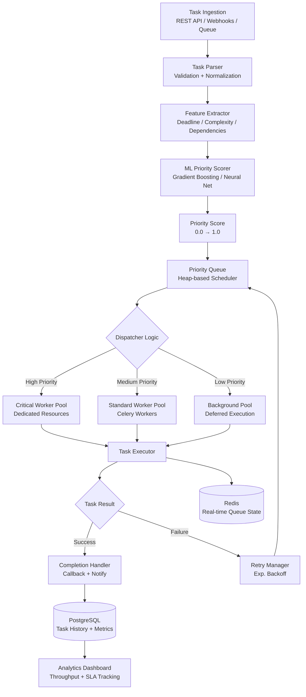

# Priority Task Dispatcher

An intelligent task prioritization and dispatching system that uses machine learning to automatically score, rank, and route tasks to the right workers — maximizing throughput and minimizing critical delays.

## Architecture



## Features

- ML-powered priority scoring based on deadline, complexity, and context
- Multi-tiered worker pools (critical / standard / background)
- Dynamic re-prioritization as deadlines approach
- Dependency-aware scheduling — blocks tasks until dependencies complete
- Intelligent retry with exponential backoff and dead-letter queue
- SLA monitoring with alerts when tasks risk breaching deadlines
- Real-time dashboard with queue health metrics
- REST API and webhook ingestion
- Pluggable executor backends (Celery, RQ, threading, subprocess)

## Tech Stack

| Layer | Technology |
|-------|-----------|
| Language | Python 3.10+ |
| API | FastAPI |
| ML Model | scikit-learn (GBM) / PyTorch |
| Task Queue | Celery + Redis |
| Database | PostgreSQL + SQLAlchemy |
| Scheduling | APScheduler |
| Dashboard | Streamlit / Grafana |
| Messaging | Redis Pub/Sub |
| Monitoring | Prometheus + Alertmanager |

## How to Run

```bash
# 1. Clone and install
git clone https://github.com/jadfarhat-cell/priority-task-dispatcher.git
cd priority-task-dispatcher
pip install -r requirements.txt

# 2. Configure environment
cp .env.example .env
# Set DATABASE_URL, REDIS_URL, etc.

# 3. Start infrastructure
docker-compose up -d # PostgreSQL + Redis

# 4. Initialize database
python manage.py migrate

# 5. Train or load priority model
python train_model.py --data data/task_history.csv
# or use pretrained:
python train_model.py --load checkpoints/priority_model.pkl

# 6. Start the API server
uvicorn dispatcher.api:app --reload --port 8000

# 7. Start Celery workers
celery -A dispatcher.tasks worker --loglevel=info --concurrency=8

# 8. Launch dashboard
streamlit run dashboard.py
```

## Project Structure

```
priority-task-dispatcher/
├── dispatcher/
│ ├── api.py # FastAPI endpoints
│ ├── scheduler.py # Priority queue + dispatch logic
│ ├── executor.py # Task execution layer
│ ├── retry.py # Retry + dead-letter handling
│ └── tasks.py # Celery task definitions
├── ml/
│ ├── feature_extractor.py# Task feature engineering
│ ├── priority_model.py # ML scoring model
│ └── trainer.py # Model training pipeline
├── dashboard.py # Real-time Streamlit dashboard
├── train_model.py # Training CLI
├── manage.py # DB migrations + management
├── checkpoints/ # Saved model weights
├── docker-compose.yml
├── requirements.txt
└── .env.example
```

## Priority Scoring Features

The ML model scores tasks using:

| Feature | Description |
|---------|-------------|
| `time_to_deadline` | Hours remaining until SLA breach |
| `estimated_duration` | Predicted execution time |
| `dependency_count` | Number of blocked downstream tasks |
| `failure_cost` | Business impact score if task fails |
| `retry_count` | Number of previous attempts |
| `task_type_encoded` | Category embedding |
| `requester_priority` | Requester SLA tier (gold/silver/bronze) |